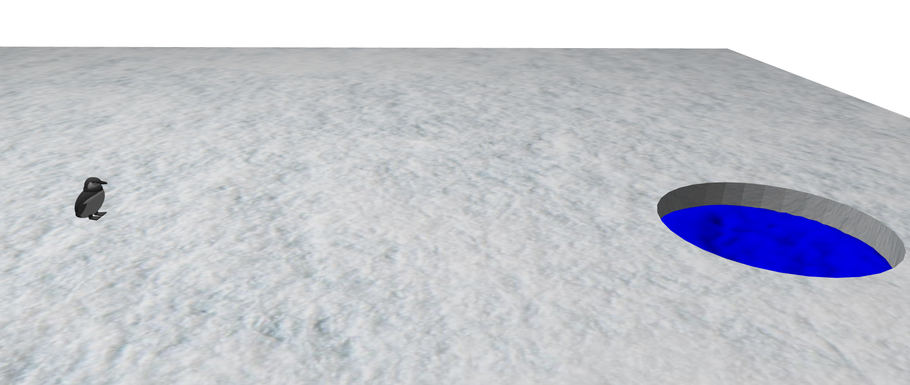

# Auteurs : Azéline Aillet et Gabriel Jacquinot
## Sommaire :

<!-- TOC -->
* [Auteurs : Azéline Aillet et Gabriel Jacquinot](#auteurs--azéline-aillet-et-gabriel-jacquinot)
  * [Sommaire :](#sommaire-)
* [Rapport Projet 📖](#rapport-projet-)
  * [Objectif du projet](#objectif-du-projet)
  * [Les différentes parties du projet](#les-différentes-parties-du-projet)
    * [1. Les modèles de la scène](#1-les-modèles-de-la-scène)
    * [2. L'eau](#2-leau)
    * [3. Les collision](#3-les-collision)
<!-- TOC -->

# Rapport Projet 📖

## Objectif du projet

Le but de notre projet était de créer un pingouin qui glisse sur la glace et qui tombe dans l'eau (plouf ! 💦).

## Les différentes parties du projet
### 1. Les modèles de la scène

Le pingouin que l'on voit dans la scène (M. Pingu), a été entièrement modélisé grâce à la bibliothèque gcp. C'est un assemblage de mesh_primitive, dont certains ont été peints avec une texture, d'autres ont simplement une couleur unie.

Nous avions aussi créé un modèle plus simplifié de M. Pingu (Pingu Cartoon), mais nous ne l'avons finalement pas utilisé.

La banquise a été modélisée sur Blender, afin notamment de pouvoir faire un trou à travers, ce qui est difficilement faisable avec des mesh_primitive. Cela nous a permis aussi de faire le UV mapping directement sur Blender, pour faciliter l'application d'une texture de neige répétée.

### 2. L'eau

La principale difficulté du projet a été de créer de l'eau en 3D.

En effet, du fait de passer en 3D, il ne suffit plus de simplement peindre une grille 2D, on doit créer un mesh.
Pour cela, nous utilisons un marching cube, pris honteusement dans les exemples de la bibliothèque.

Nous l'avons adapté à nos besoins en changeant la fonction évaluée dans le domaine spatial défini, et en ajoutant différentes fonctions de lissage.
Le rendu de l'eau est en partie personnalisable via l'interface graphique du projet.

### 3. Les collision

Les collisions de la scène ont été grossièrement implémentées, en effet l'eau est confinée dans un tube invisible, M. Pingu a une hitbox en pavé droit, et la collision avec le sol est gérée par rapport aux coordonnées de celui-ci.
Pour ce qui est de l'eau, elle réagit à la hitbox de M. Pingu en se faisant repousser d'une fraction de sa vitesse dans la direction de la normale, elle n'a pas de réaction sur M. Pingu.
