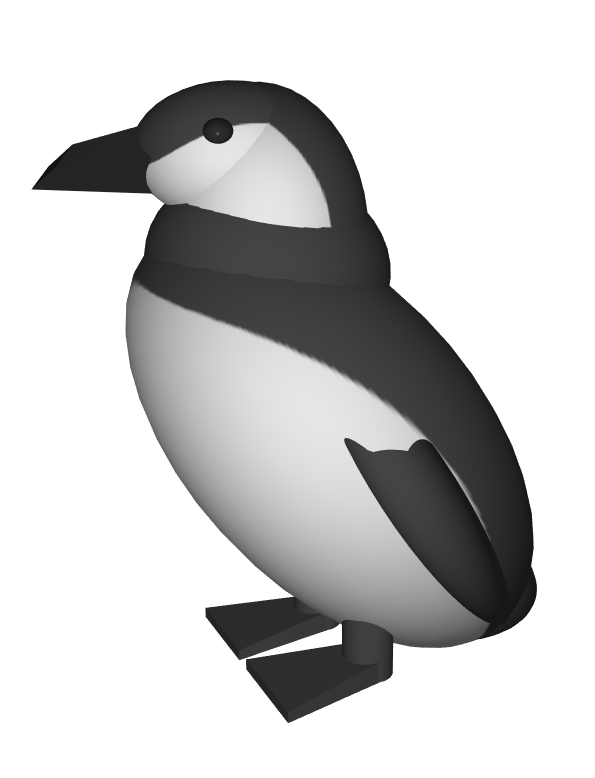
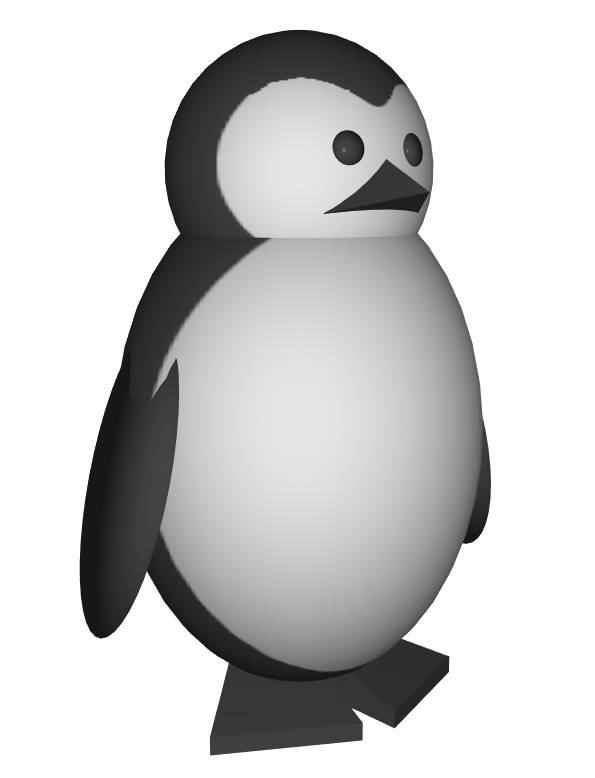
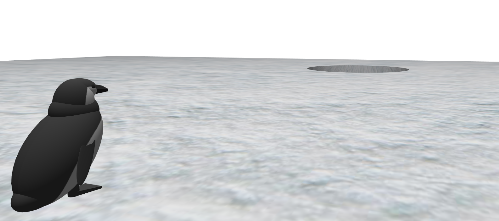

# Auteurs : Azéline Aillet et Gabriel Jacquinot
## Sommaire :

<!-- TOC -->
* [Auteurs : Azéline Aillet et Gabriel Jacquinot](#auteurs--azéline-aillet-et-gabriel-jacquinot)
  * [Sommaire :](#sommaire-)
* [Setup pre-commit  🏗️](#setup-pre-commit-)
* [Enforce pre-commit to run 🏃](#enforce-pre-commit-to-run-)
* [Rapport Projet 📖](#rapport-projet-)
  * [Objectif du projet](#objectif-du-projet)
  * [Les différentes parties du projet](#les-différentes-parties-du-projet)
    * [1. Les modèles de la scène](#1-les-modèles-de-la-scène)
    * [2. L'eau](#2-leau)
    * [3. Collision](#3-collision)
* [Vidéos :](#vidéos-)
<!-- TOC -->

# Setup pre-commit  🏗️

```shell
sudo apt-get install clang-format
pip install pre-commit
pre-commit install
```


# Enforce pre-commit to run 🏃

```shell
pre-commit run --all-files
```

# Rapport Projet 📖

## Objectif du projet

Le but de notre projet, était de faire un pingouin qui glisse sur la glace et qui tombe dans l'eau (plouf ! 💦).

## Les différentes parties du projet
### 1. Les modèles de la scène

Le pingouin que l'on voit dans la scène (M. Pingu), a été entièrement modélisé grâce à la bibliothèque gcp. C'est un assemblage de mesh_primitive, dont certain ont été peint avec une texture, d'autres ont simplement une couleur unis.

On avait aussi crée un modèle plus simplifié de M. Pingu (Pingu Cartoon), mais on ne l'a finalement pas utilisé.




La banquise a été modélisée sur Blender, afin notamment de pouvoir faire un trou à travers, ce qui est difficilement faisable avec des mesh_primitive. Ca nous a permis aussi de faire le UV mapping directement sur Blender, pour faciliter l'application d'une texture de neige répétée.



### 2. L'eau

La difficulté principale du projet à été de faire de l'eau en 3D.

En effet, du fait de passer en 3D, il ne suffit plus de simplement peindre une grille 2D, on doit créer un mesh.
Pour cela, nous utilisons un marching cube, pris honteusement dans les exemples de la bibliothèque.

Nous l'avons adapté à nos besoins en changeant la fonction évaluée dans le domaine spatiale défini, et en ajoutant différente fonctions de lissages.
Le rendu de l'eau est en partie personnalisable via l'interface graphique du projet.


### 3. Collision

Les collisions de la scène ont été grossièrement implémentées, en effet l'eau est confinée dans un tube invisible, M. Pingu a une hitbox en pavé droit, et la collision avec le sol est géré par rapport aux coordonée de celui ci.

# Vidéos :

<video width="320" height="240" controls>
  <source src="readme_resources/Splash.webm" type="video/webm">
  Votre navigateur ne prend pas en charge la lecture de vidéos au format MP4.
</video>
